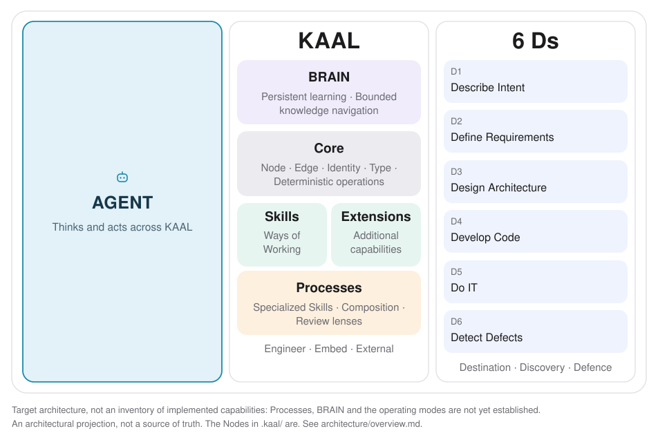

# KAAL conceptual architecture overview

## What this is, and what it is not

The picture shows three columns, Agent, KAAL and the 6 Ds, with a colour per kind of part: BRAIN, Core, capabilities (Skills and Extensions) and Processes. This is the target architecture of KAAL: the shape its parts are meant to take and the responsibilities they are meant to keep apart. It is not an inventory of what is built. Some parts below exist as sealed Nodes and packages, some exist only as a direction, and the picture does not say which. This document does.

It is also not an authority. KAAL's meanings live in its Nodes, and the overview projects them; it does not restate them, extend them or replace them. Anything here that disagrees with a Node is wrong. Read the Nodes by following references from Core (start at `.kaal/AGENTS.md`), not by treating this page as a second source of truth. Nothing in this directory is a Node or is sealed.

## Three columns

The picture reads left to right: an Agent uses KAAL, and works across the Six Ds through it.

### Agent

The Agent thinks and acts across KAAL. It is the actor. KAAL is the Agent's persistent body of knowledge and capabilities, and it does not replace the Agent or act for it. KAAL persists independently of any one agent, provider, model or context window, so what an Agent learns and the capabilities it has are not lost when the actor changes.

Established: the Node `Agent` defines how agents use KAAL and the BASS ladder (Bare, Agent, Skill, Script). It speaks of the instructions that connect an agent to KAAL. That the Agent stands outside KAAL's persistent structure as its actor is the agreed direction of this overview and is not stated by a Node today.

### KAAL

- **BRAIN.** Persistent learning and bounded knowledge navigation: the accumulated, navigable knowledge an Agent draws on. *Target architecture.* No Node defines BRAIN yet; work toward it is in progress in a separate Change and this page claims nothing about what it will be.
- **Core.** Owns Node and Edge semantics, identity, type and deterministic operations, including admission. Core is the stable backbone the rest relies on and it stays small: capabilities join through registration and do not become Core. *Established.* See `Core`, `CASE`, `Node`, `Edge`, `KAAL Definition` and `KERNEL.md` in `.kaal/core/`.
- **Skills.** Independent Ways of Working through which capabilities join KAAL. Sealing is a Skill in its own right, independent of Core and of the Skills that consume it: Core defines what identity is, Sealing establishes and verifies it. *Established.* See the Node `Skill` in `.kaal/core/` and, for example, `Sealing`, `Intent`, `Changing KAAL`, `Retro` and `Review` among the packages in `packages/`.
- **Extensions.** Capabilities that join KAAL through their own registration and, like Skills, without becoming Core. *Established as a definition.* See the Node `Extension`.
- **Processes.** Specialized Skills that compose other capabilities and establish governed agency, so that the relationships between capabilities live in a Process and not inside each Skill. Deterministic grants, denials and escalation within a Process are an emerging requirement, not an implemented guarantee; the picture itself carries no such marker, so this text and the table below are what say it. *Target architecture.* `Changing KAAL` is the nearest existing example of a capability that composes others, and whether it is a Process is an open question for its own Change, not something the overview decides.
- **Engineer, Embed, External.** The three operating modes in which KAAL is used. The same capabilities carry the same meaning in each; the mode says where and how KAAL is operated and changes nothing about what it means. *Target architecture.* No Node defines the modes. The Nodes `Collecting KAAL`, `KAAL Incident` and `KAAL Request` speak of a client's embedded KAAL, which is the nearest established vocabulary.

### Six Ds

What the Agent works on through KAAL: Describe Intent, Define Requirements, Design Architecture, Develop Code, Do IT and Detect Defects, framed by Destination, Discovery and Defence. The Six Ds name kinds of work, not KAAL machinery. KAAL adds no privileged mechanism for any of them; it offers capabilities that serve them, and which capabilities serve which D is for those capabilities to say.

*Target architecture, partly realized.* `Intent` (the Skill that describes and establishes an Intent) is the one part of the Six Ds with an established capability today. This overview does not map the framing words Destination, Discovery and Defence onto individual Ds beyond showing them as the frame around the six.

## What is implemented

| Part | State | Authority |
| --- | --- | --- |
| Core | Established | `.kaal/core/`, `packages/kaal-core/` |
| Skill, Extension (registration) | Established | Nodes `Skill`, `Extension` |
| Sealing, Intent, Changing KAAL, Retro, Review and others | Established as optional capabilities | their Nodes in `packages/*/kaal/` and `.kaal/skills/` |
| Agent entry (`AGENTS.md` to `.kaal/AGENTS.md` to Core) | Established | Node `Agent` |
| BRAIN | Target architecture | none yet |
| Processes, and deterministic grants, denials and escalation | Target architecture, emerging requirement | none yet |
| Engineer / Embed / External as named modes | Target architecture | none yet |
| The Six Ds beyond Intent | Target architecture | none yet |

This table is a reading of the repository at the time of writing and is not itself kept current by anything. When it disagrees with the repository, the repository wins.

## Relation to Design Architecture (D3)

This overview is an early architectural result of applying Design Architecture thinking to KAAL itself. D3 is fundamental to the Six Ds but is not yet established as a dedicated Skill, and this page does not define its Way of Working.

When a Design Architecture Skill is established, revisit this artifact as a concrete example of architectural Work: evaluate its structure, traceability, architectural decisions and relationship to the established Nodes against that Skill. The overview remains a maintained architectural projection, and its future evolution is governed by the capabilities established at that time.

## Keeping it true

The overview changes by a Change, like anything else in this repository. When a part moves from target to established, update the table and the text here in the same Change that establishes it, and point at the Node that now carries its meaning. Do not add detail here that a Node should own.
